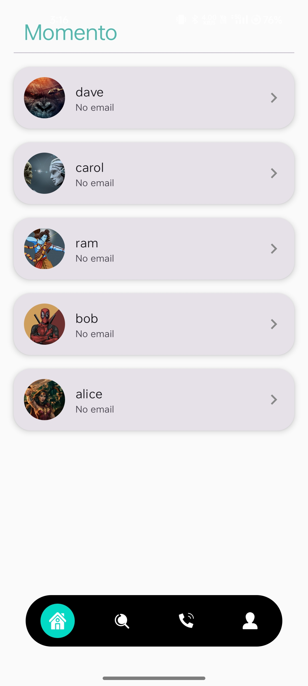
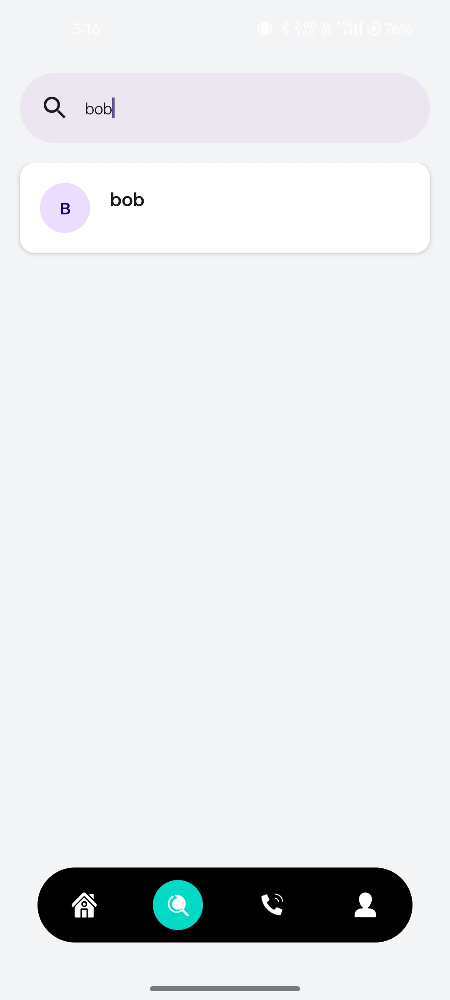
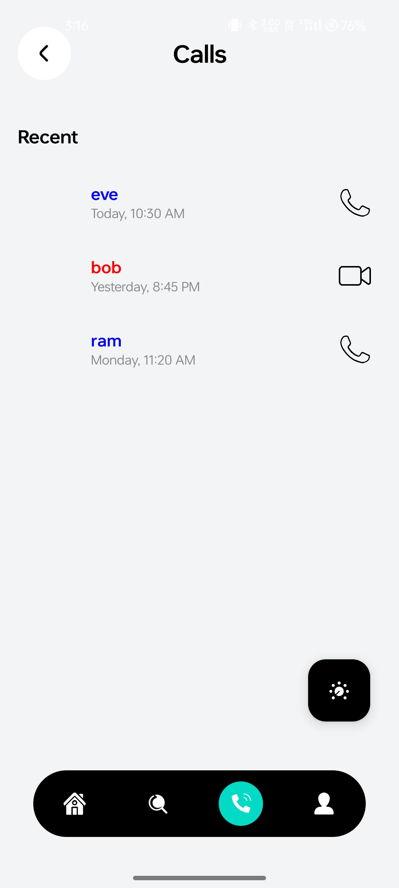
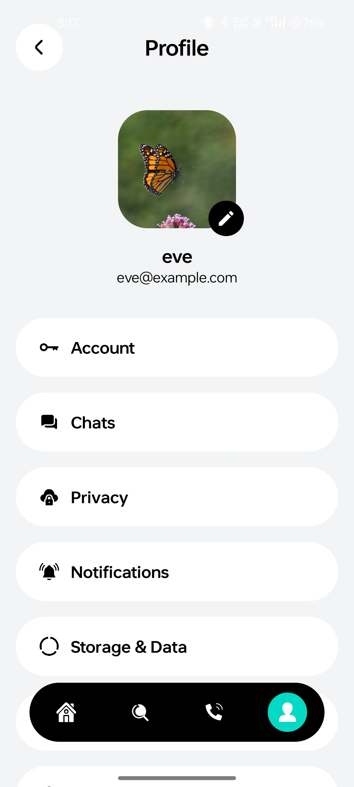

Quick Chat App

A quick chat application using Back4app (a leading Parse-based backend service) provides a scalable, real-time communication platform with minimal backend overhead.

FEATURES and COMPONENTS

Real-Time Synchronization:
Leverages Back4app LiveQuery to deliver instant messages and notifications without page reloads.

User Management: 
Includes secure registration and login using built-in Parse User classes, supporting custom fields like avatars and online status.

Persistent Messaging:
All conversations are stored in a structured NoSQL-style database, allowing users to retrieve full chat histories across multiple devices.

Presence Tracking:
Displays real-time online/offline status and "typing" indicators by monitoring active WebSocket connections.

Multimedia Sharing:
Supports file uploads for images, videos, and documents directly through Back4app File Storage.

       

